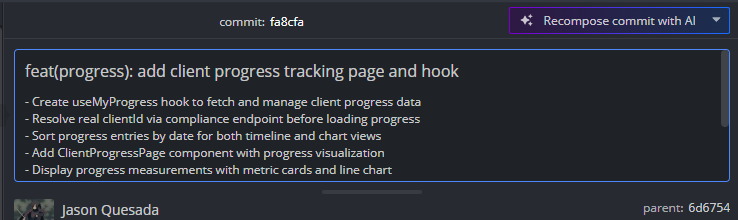

# Evidencia de Tarea - Sprint

**Nombre:** Jason Quesada Gomez
**Sprint:** 3
**Tarea:** Implementar gráficos de visualización de progreso del cliente
**Fecha:** 15/06/2026
**ID:** 86bahqd9p

## Trabajo realizado

* Analizar los datos disponibles para la representación gráfica del progreso.
* Implementar gráficos de líneas para visualizar la evolución de las métricas registradas.
* Ordenar cronológicamente los registros para garantizar una representación correcta.
* Incorporar controles de selección de métricas y navegación entre registros.
* Complementar la visualización con indicadores numéricos y tarjetas de resumen.

## Funcionalidades desarrolladas

* Visualización gráfica de la evolución del cliente mediante gráficos de progreso.
* Selección de métricas específicas para su análisis.
* Navegación entre diferentes períodos y registros históricos.
* Tarjetas resumen con los principales indicadores físicos.
* Actualización dinámica de los datos mostrados según la métrica seleccionada.

## Hallazgos y consideraciones

* Los datos debían ser ordenados por fecha para asegurar la precisión de los gráficos.
* Se identificó la necesidad de complementar la visualización gráfica con indicadores numéricos.
* Fue necesario optimizar la experiencia de usuario para facilitar la interpretación de los datos.
* Se validó el comportamiento de la visualización ante diferentes volúmenes de información.

## Resultado

Se implementaron gráficos interactivos que permiten a los clientes visualizar la evolución de sus métricas físicas a lo largo del tiempo. La funcionalidad facilita el seguimiento de avances, mejora la comprensión de los resultados obtenidos y contribuye a la motivación del usuario al evidenciar su progreso de manera visual.

