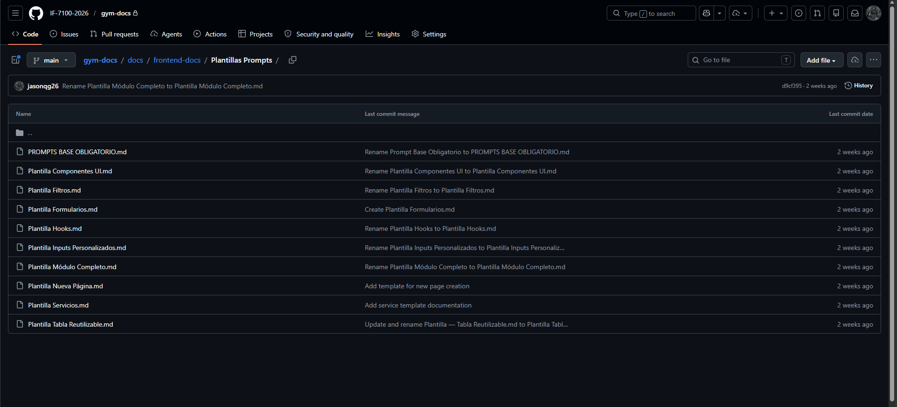

# Evidencia de Tarea - Sprint 2

**Nombre:** Jason Quesada Gomez
**Sprint:** 2
**Tarea:** Crear plantilla para prompts del agente IA
**ID:** 86ba35d8y
**Fecha:** 06/05/2026

---

## Trabajo realizado

- Se definió un formato estándar de instrucciones para la interacción con el agente IA dentro del contexto del proyecto frontend en React y TypeScript.
- Se especificaron las reglas arquitectónicas que deben respetarse al generar código mediante el agente, asegurando coherencia con la estructura del proyecto.
- Se elaboraron plantillas específicas para los distintos tipos de artefactos frontend identificados durante la auditoría arquitectónica: componentes UI, filtros, formularios, hooks, inputs personalizados, módulos completos, páginas, servicios y tablas reutilizables.
- Se creó un documento base obligatorio (`PROMPTS BASE OBLIGATORIO.md`) que establece el contexto, restricciones y lineamientos generales que deben incluirse en todo prompt dirigido al agente.
- Se organizaron todas las plantillas dentro de la estructura de documentación del repositorio, bajo la ruta `docs/frontend-docs/Plantillas Prompts/`.

---

## Evidencia

### Carpeta de plantillas generada

Se creó la siguiente estructura en el repositorio de documentación del proyecto:

**Ruta:** [`gym-docs/docs/frontend-docs/Plantillas Prompts`](https://github.com/IF-7100-2026/gym-docs/tree/main/docs/frontend-docs/Plantillas%20Prompts)

### Archivos generados

| Archivo | Descripción |
|---|---|
| `PROMPTS BASE OBLIGATORIO.md` | Documento de contexto general y restricciones para todos los prompts |
| `Plantilla Componentes UI.md` | Plantilla para generación de componentes de interfaz |
| `Plantilla Filtros.md` | Plantilla para implementación de lógica de filtrado |
| `Plantilla Formularios.md` | Plantilla para la creación de formularios con validación |
| `Plantilla Hooks.md` | Plantilla para la definición de custom hooks |
| `Plantilla Inputs Personalizados.md` | Plantilla para inputs reutilizables con control externo |
| `Plantilla Módulo Completo.md` | Plantilla integral para generación de módulos funcionales |
| `Plantilla Nueva Página.md` | Plantilla para la creación de páginas siguiendo la arquitectura base |
| `Plantilla Servicios.md` | Plantilla para la definición de servicios y consumo de APIs |
| `Plantilla Tabla Reutilizable.md` | Plantilla para tablas con soporte de paginación y columnas configurables |

### Captura del repositorio

### Objetivos cumplidos

- Definición de un formato estándar de instrucciones para el agente IA.
- Especificación de reglas arquitectónicas dentro de los prompts.
- Creación de ejemplos de prompts válidos por tipo de artefacto.
- Cobertura de los artefactos frontend identificados en la auditoría: componentes, hooks, servicios, formularios, filtros, páginas y módulos.
- Integración de la documentación dentro del repositorio oficial del proyecto.

---

## Resultado

Se estableció una colección estructurada de plantillas de prompts orientadas al agente IA, diseñada para garantizar que el código generado sea coherente con la arquitectura definida para el frontend. Estas plantillas funcionan como guía estandarizada para el equipo, reduciendo la variabilidad en los prompts y asegurando que las instrucciones al agente incluyan siempre el contexto arquitectónico necesario. La tarea fue marcada como **COMPLETE** en el gestor de proyectos el 26/05/2026.