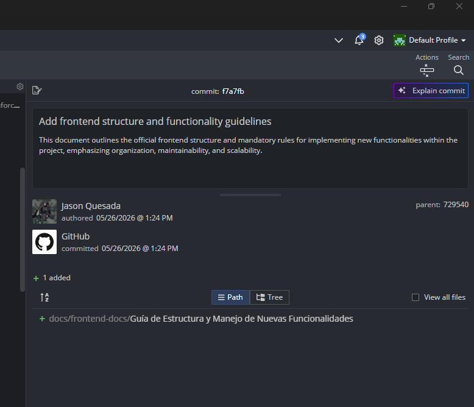

# Evidencia de Tarea - Sprint

**Nombre:** Jason Quesada Gomez
**Sprint:** 2
**Tarea:** Estandarizar componentes UI
**ID:** 86ba35d8u
**Fecha:** 05/06/2026

## Trabajo realizado

* Se revisaron los componentes de interfaz existentes en el proyecto.
* Se identificaron diferencias en estilos, convenciones y estructura entre componentes.
* Se definieron criterios para la creación de componentes reutilizables.
* Se analizaron las props utilizadas para promover consistencia y reutilización.
* Se establecieron lineamientos para mantener una experiencia visual uniforme en la aplicación.

## Evidencia

### Objetivos cumplidos

* Unificación de estilos y patrones visuales.
* Definición de criterios para componentes reutilizables.
* Revisión de props y convenciones de desarrollo.

**ID Commit:** 
f7a7fb799f2dcc06f71c3e2cdd7be0702a352518

### Resultado

Se establecieron estándares para los componentes de interfaz del proyecto, permitiendo una mayor consistencia visual, mejor reutilización de código y una base más sólida para el crecimiento del frontend.

