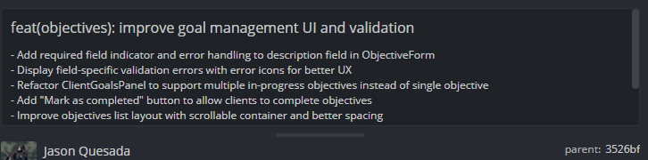

# Evidencia de Tarea - Sprint

**Nombre:** Jason Quesada Gomez
**Sprint:** 3
**Tarea:** Mejorar gestión de objetivos y validaciones en la interfaz de usuario
**Fecha:** 09/06/2026

## Trabajo realizado

* Analizar el flujo actual de gestión de objetivos del cliente.
* Mejorar las validaciones del formulario de objetivos.
* Implementar mensajes de error más claros y visibles para el usuario.
* Refactorizar los componentes relacionados con la gestión de objetivos.
* Incorporar nuevas funcionalidades para el seguimiento y finalización de objetivos.

## Funcionalidades implementadas

* Indicador visual de campos obligatorios en el formulario de objetivos.
* Validación del campo descripción con manejo de errores específico.
* Visualización de mensajes de error acompañados por iconografía para mejorar la experiencia de usuario.
* Soporte para múltiples objetivos en progreso de manera simultánea.
* Botón para marcar objetivos como completados.
* Gestión de eventos para actualizar el estado de los objetivos completados.
* Mejora de la distribución visual de la lista de objetivos mediante contenedores desplazables y espaciado optimizado.
* Actualización de componentes para soportar la nueva lógica de gestión de objetivos.

## Hallazgos identificados

* La implementación anterior limitaba al cliente a un único objetivo activo.
* Los mensajes de validación no ofrecían suficiente claridad sobre los errores detectados.
* La visualización de múltiples objetivos requería una estructura más flexible y escalable.
* La experiencia de usuario podía mejorarse mediante indicadores visuales consistentes.

## Mejoras aplicadas

* Refactorización del componente de gestión de objetivos para soportar múltiples registros activos.
* Incorporación de acciones de finalización de objetivos directamente desde la interfaz.
* Estandarización de mensajes de error utilizando iconografía consistente en los formularios.
* Optimización de la presentación visual para facilitar la navegación y consulta de objetivos.

## Resultado

Se mejoró significativamente la gestión de objetivos dentro de la plataforma, permitiendo a los clientes administrar múltiples objetivos en progreso, completar objetivos desde la interfaz y recibir retroalimentación visual más clara durante el proceso de registro y edición. Estas mejoras incrementan la usabilidad, escalabilidad y mantenibilidad del sistema.

