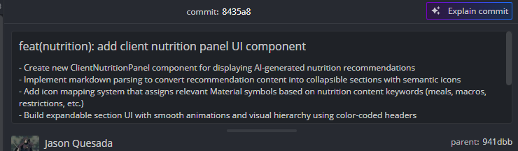

# Evidencia de Tarea - Sprint

**Nombre:** Jason Quesada Gomez
**Sprint:** 3
**Historia de Usuario:** Como cliente, quiero consultar mi recomendación alimenticia aprobada, para seguir una guía nutricional orientativa.
**Fecha:** 09/06/2026
**ID:**86b9g1tcv

## Trabajo realizado

* Analizar los requerimientos funcionales de consulta de recomendaciones alimenticias.
* Implementar la interfaz para visualizar recomendaciones aprobadas.
* Integrar el frontend con el servicio correspondiente para obtener la recomendación alimenticia del usuario.
* Validar el manejo de estados de carga y ausencia de datos.
* Verificar la correcta visualización de la información nutricional proporcionada.

## Funcionalidades implementadas

* Consulta de recomendaciones alimenticias aprobadas.
* Visualización clara y ordenada de la recomendación nutricional.
* Consumo de datos desde el backend mediante servicios API.
* Manejo de mensajes informativos cuando no existen recomendaciones disponibles.
* Validación de acceso para usuarios autenticados.

## Consideraciones técnicas

* Integración con los endpoints definidos para recomendaciones alimenticias.
* Aplicación de componentes reutilizables de la interfaz.
* Manejo de estados de carga y errores de consulta.
* Adaptación de la vista a la estructura general del sistema.

## Resultado

Se habilitó la funcionalidad para que los clientes puedan consultar sus recomendaciones alimenticias aprobadas desde la plataforma, permitiéndoles acceder a una guía nutricional orientativa de forma sencilla y centralizada. La funcionalidad fue probada y validada satisfactoriamente.

