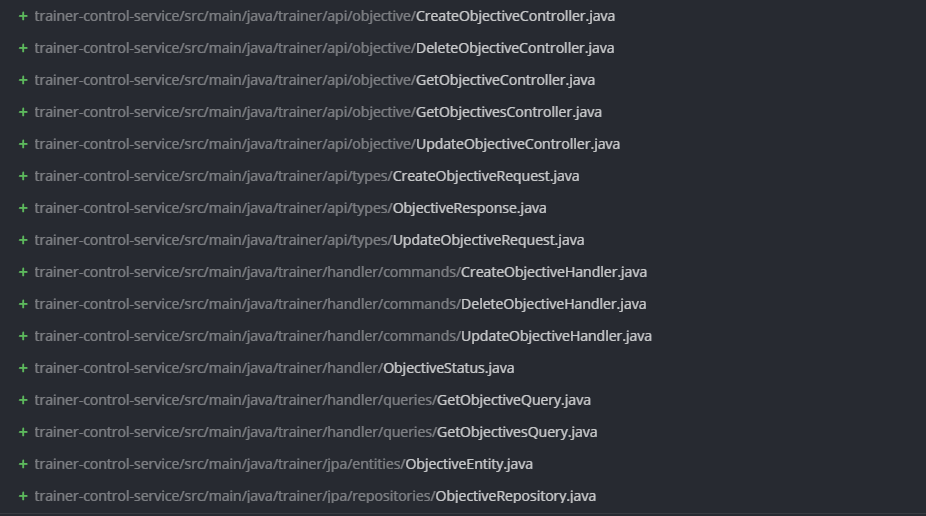

# Evidencia de Tarea - Sprint

**Nombre:** Jason Quesada Gomez
**Sprint:** 2
**Tarea:** Registrar rendimiento del cliente en sus ejercicios
**Fecha:** 21/05/2026]

## Trabajo realizado

Se implementó la funcionalidad de:

Como entrenador, quiero registrar el rendimiento del cliente en sus ejercicios, para evaluar su desempeño en la rutina.

>Solo se realizo la funcionalidad del back-end

## Archivos modificados



## Evidencia

**Rama:**

```text
Metas
```

**Commit:**

```text
Implement objective management: create, update, delete, and retrieve objectives with associated client progress

6b9a995c2052571944d3c9c23ef65309aea2746d
```

**Pull Request:**

```text
https://github.com/IF-7100-2026/gym-backend/pull/20
```
