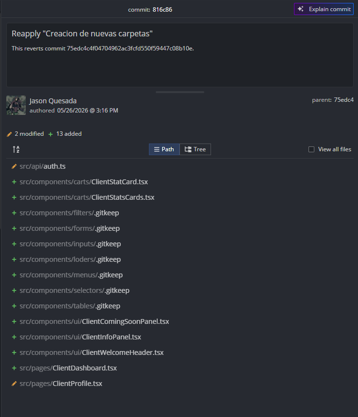

# Evidencia de Tarea - Sprint

**Nombre:** Jason Quesada Gomez
**Sprint:** 2
**Tarea:** Definir arquitectura base del proyecto
**ID:** 86ba35d8t
**Fecha:** 02/06/2026

## Trabajo realizado

* Se analizó la estructura actual del frontend.
* Se definió una organización base de carpetas para mejorar la mantenibilidad del proyecto.
* Se estableció una separación clara de responsabilidades entre páginas, componentes, hooks y servicios.
* Se identificaron módulos susceptibles de reutilización para reducir duplicación de código.
* Se documentaron lineamientos para futuras implementaciones siguiendo una arquitectura consistente.

## Evidencia

### Objetivos cumplidos

* Estructura de carpetas definida.
* Separación de responsabilidades establecida.
* Organización de módulos reutilizables propuesta.

**ID Comit:** 816c86403bd7527222f20d9204069d3f3376e11f

### Resultado

Se estableció una arquitectura base para el frontend con el objetivo de mejorar la escalabilidad, mantenibilidad y organización del código, facilitando el desarrollo de nuevas funcionalidades y la reutilización de componentes.

