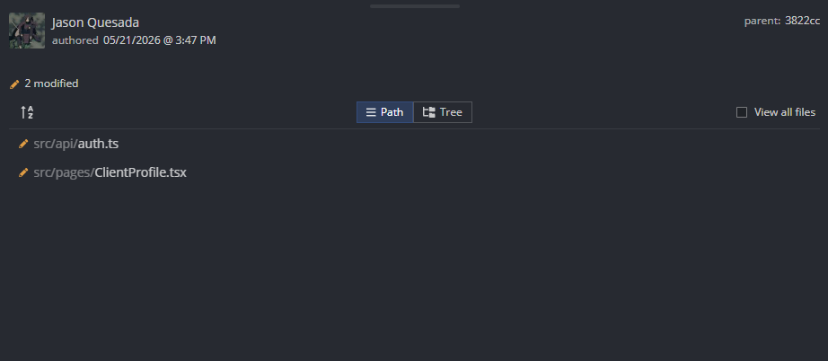

# Evidencia de Tarea - Sprint

**Nombre:** Jason Quesada Gomez
**Sprint:** 2
**Tarea:** Registrar rendimiento del cliente en sus ejercicios front-end parte 1 
**Fecha:** 21/05/2026

## Trabajo realizado

Se implementó la funcionalidad de en el front end:
Como entrenador, quiero registrar el rendimiento del cliente en sus ejercicios, para evaluar su desempeño en la rutina.
 

## Archivos modificados



## Evidencia

**Commit:**

```text
Implement objective management: create, update, delete, and retrieve objectives with associated client progress

ID  comit: e9f81d0d8292813882b38ca048cca0280fff4690
```

