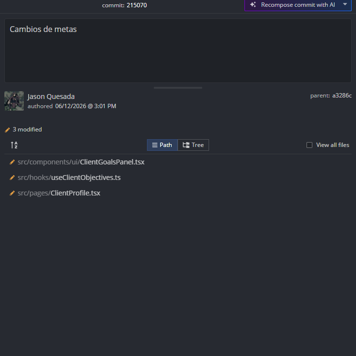

# Evidencia de Tarea - Sprint

**Nombre:** Jason Quesada Gomez
**Sprint:** 2
**Tarea:** Registrar rendimiento del cliente en sus ejercicios front-end parte 2
**Fecha:** 12/06/2026

## Trabajo realizado

Se implementó la funcionalidad de en el front end:
Como entrenador, quiero registrar el rendimiento del cliente en sus ejercicios, para evaluar su desempeño en la rutina.

Se corrigieron errores que quedaron pendientes en la parte 1 de esta tarea
 

## Archivos modificados



## Evidencia

**Commit:**

```text
Implement objective management: create, update, delete, and retrieve objectives with associated client progress

ID  comit: 2150701cff5e43c70931a7af586c2a53ed26a9a4
```

